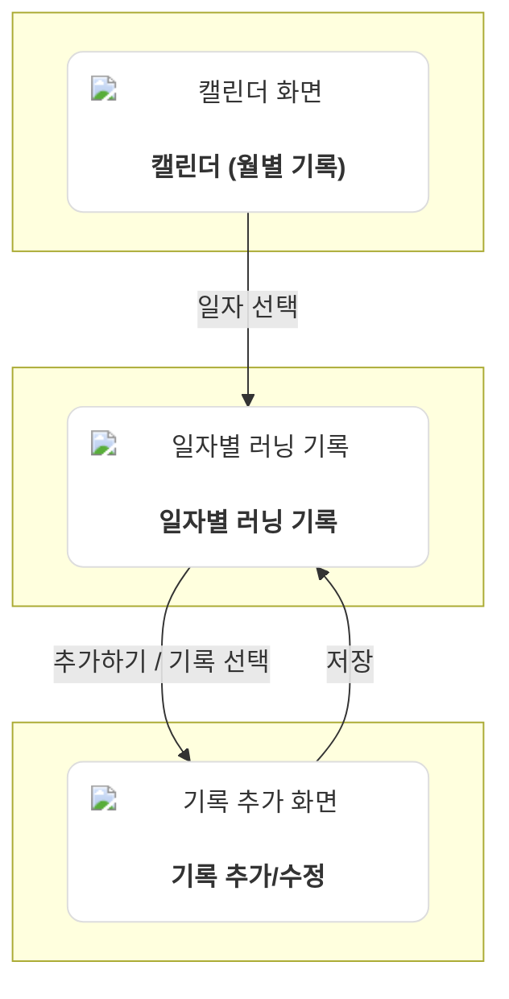

[](https://swift.org/download/)
[](https://apps.apple.com/kr/app/xcode/id497799835?mt=12)
[](https://github.com/khyeji98/RunningDiary/actions/workflows/build-and-test.yml)

# Running Diary 🏃‍♀️

Running Diary는 단순한 거리와 페이스 기록을 넘어, 러닝 당시의 컨디션과 경험까지 함께 저장하는 러닝 기록 iOS 앱입니다.

HealthKit 자동 연동으로 러닝 데이터를 손쉽게 불러오고, 통증 부위·수면·식사 등의 컨디션을 기록하여 러닝과 몸 상태의 상관관계를 분석할 수 있습니다. 날씨 자동 조회로 환경 요인도 함께 추적하며, 월별 캘린더로 장기 패턴을 한눈에 파악할 수 있습니다.

## 주요 기능

### HealthKit 자동 연동으로 손쉬운 기록
HealthKit에서 러닝 데이터(거리, 페이스, 심박수, 케이던스, 경로)를 자동으로 불러와 수동 입력 없이 빠르게 기록을 관리할 수 있습니다.

### 컨디션 기록으로 부상 예방
통증 부위, 주법, 수면 시간, 식사·음주 여부, 메모 등을 기록하여 러닝과 컨디션의 상관관계를 파악하고 부상 패턴을 분석할 수 있습니다.

### 환경 요인 추적
러닝 경로를 기반으로 당시 날씨(온도, 습도, 풍속)를 자동 조회하여 환경이 기록에 미치는 영향을 함께 분석합니다.

### 장기 패턴 파악
무한 스크롤 캘린더와 월별 총 거리 통계로 러닝 습관과 성장 추세를 장기적으로 확인할 수 있습니다.

## 스크린샷

<table>
  <tr>
    <td></td>
    <td></td>
    <td></td>
  </tr>
  <tr>
    <td align="center">캘린더 (월별 기록)</td>
    <td align="center">일자별 러닝 기록 (여러 기록)</td>
    <td align="center">일자별 러닝 기록 (상세)</td>
  </tr>
  <tr>
    <td></td>
    <td></td>
    <td></td>
  </tr>
  <tr>
    <td align="center">기록 추가 (HealthKit)</td>
    <td align="center">기록 추가 (컨디션)</td>
    <td></td>
  </tr>
</table>

## 화면 구성

### 1. 일자별 러닝 기록 화면
- **날짜 캐러셀**: 주간 날짜 선택, 좌우 스와이프로 주 단위 이동
- **러닝 기록 상세 뷰**: HealthKit 데이터(거리, 페이스, 심박수, 케이던스), 날씨 정보, 컨디션, 난이도 표시
- **"전체보기" 버튼**: 캘린더 화면으로 이동
- **"추가하기" 버튼**: 기록 추가 화면으로 이동

### 2. 캘린더 화면
- **월별 캘린더 UI**: 각 일자마다 러닝 기록 요약 정보 표시
- **무한 스크롤**: 과거로 스크롤 시 이전 6개월 데이터 자동 로드
- **월간 통계**: 월별 총 거리 표시
- **화면 전환**: 일자 선택 시 해당 날짜의 상세 기록 화면으로 이동

### 3. 기록 추가/수정 화면
- **HealthKit 연동**: 워크아웃 데이터 자동 불러오기
- **컨디션 입력**: 통증 부위, 주법, 수면·식사·음주·메모
- **신발 선택**: 신발 모델 리스트
- **난이도 레벨**: 5단계(매우 쉬움 ~ 매우 어려움)
- **폼 검증**: 필수 항목 입력 확인 후 저장

## 화면 흐름도



## 기술 구현 현황

### 아키텍처 & 패턴
- ✅ **TCA 아키텍처**: State-Action-Reducer 패턴으로 예측 가능한 상태 관리
- ✅ **Repository 패턴**: 데이터 접근 추상화로 도메인과 퍼시스턴스 분리
- ✅ **의존성 주입**: TCA Dependency 시스템으로 테스트 용이성 확보

### 데이터 & 통합
- ✅ **SwiftData 퍼시스턴스**: CRUD 작업 완전 구현, 트랜잭션 관리
- ✅ **HealthKit 통합**: 거리, 페이스, 심박수, 케이던스, 경로 데이터 수집
- ✅ **WeatherKit 통합**: 온도, 습도, 풍속 자동 조회

### 성능 & 최적화
- ✅ **월 단위 데이터 캐싱**: 불필요한 DB/네트워크 조회 방지
- ✅ **병렬 데이터 조회**: HealthKit + SwiftData 동시 조회로 성능 개선
- ✅ **캘린더 무한 스크롤**: Lazy Loading으로 효율적인 데이터 로드

### 품질
- ✅ **Swift Testing + TCA TestStore**: 주요 Feature 및 Client 테스트 커버리지
- ✅ **3개 언어 로컬라이제이션**: 한국어, 영어, 일본어
- ✅ **GitHub Actions CI/CD**: 자동 빌드 및 테스트
  
### 진행 중
- ⏳ **경로 지도 UI 렌더링**: 경로 데이터 저장 완료, UI 개발 중

## 아키텍처

```
Features (UI)
    ↓
Clients (TCA Dependency)
    ↓
Services (HealthKit/Weather/SwiftData)
    ↓
Repository (Data Access)
    ↓
SwiftData (Persistence)
```

계층별로 명확히 분리된 구조로 테스트 용이성과 유지보수성을 확보했습니다.

## 기술 스택

### 핵심
- **SwiftUI**: 선언적 UI 프레임워크
- **TCA (The Composable Architecture)**: 단방향 데이터 흐름과 합성 가능한 아키텍처
- **Swift Concurrency**: async/await 기반 비동기 처리

### 데이터
- **SwiftData**: 퍼시스턴스 프레임워크

### 통합
- **HealthKit**: 러닝 데이터 수집
- **WeatherKit**: 날씨 정보 조회

### 개발 도구
- **Swift Testing**: 테스트 프레임워크
- **SwiftLint**: 코드 스타일 검사
- **GitHub Actions**: CI/CD

### UI 라이브러리
- **HorizonCalendar**: 캘린더 UI

## 협업

Git 워크플로우, 커밋/PR 규칙, 개발 가이드라인은 [CONTRIBUTING.md](./CONTRIBUTING.md)를 참고하세요.
