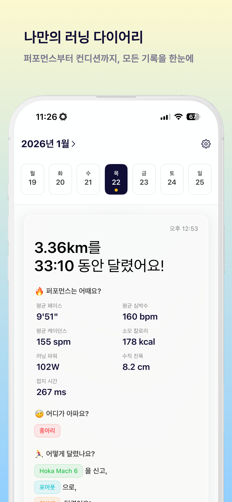
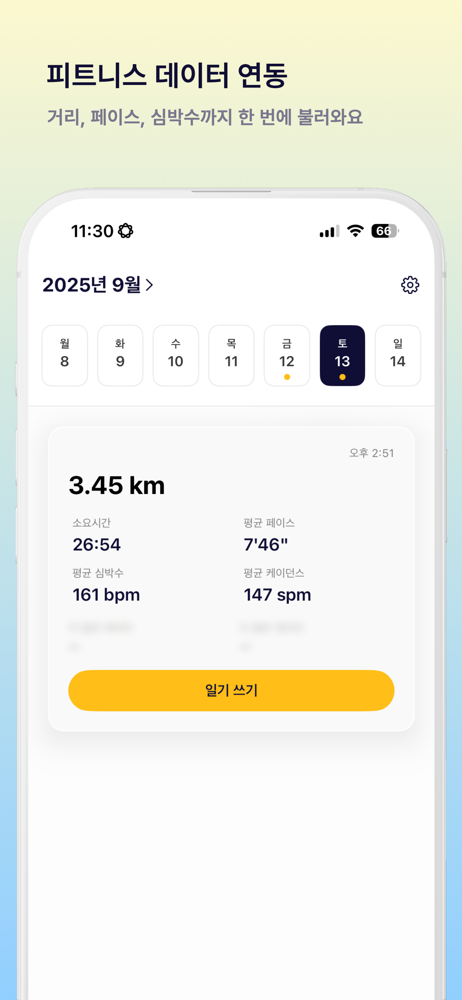
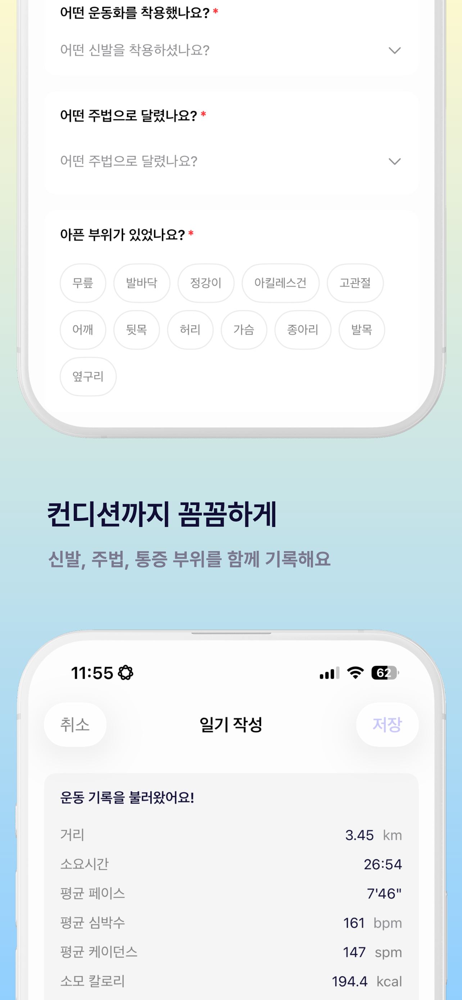
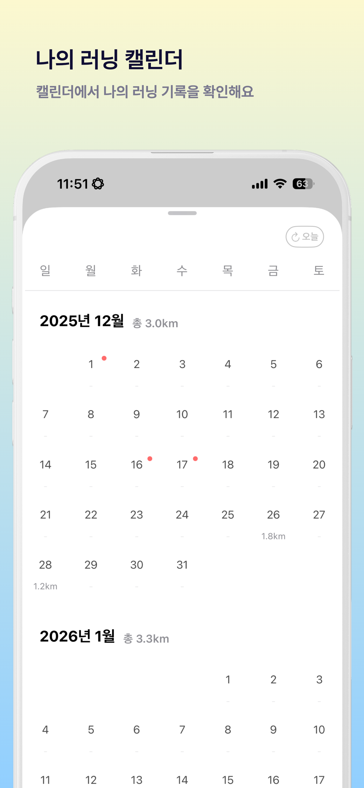
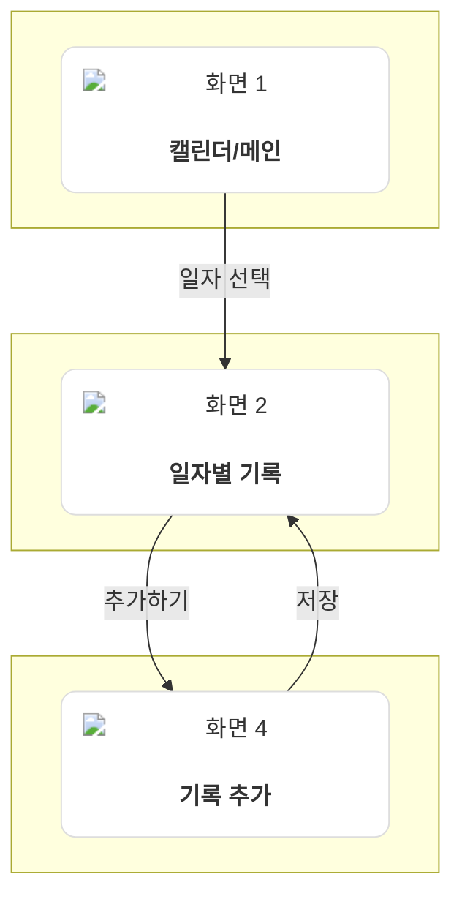

[](https://swift.org/download/)
[](https://apps.apple.com/kr/app/xcode/id497799835?mt=12)
[](https://github.com/khyeji98/RunningDiary/actions/workflows/build-and-test.yml)
[](https://apps.apple.com/app/id6755971012)

# Running Diary 🏃‍♀️

Running Diary는 단순한 거리와 페이스 기록을 넘어, 러닝 당시의 컨디션과 경험까지 함께 저장하는 러닝 기록 iOS 앱입니다.

HealthKit 자동 연동으로 러닝 데이터를 손쉽게 불러오고, 통증 부위·수면·메모 등의 컨디션을 기록하여 러닝과 몸 상태의 상관관계를 분석할 수 있습니다. 날씨 자동 조회로 환경 요인도 함께 추적하며, 월별 캘린더로 장기 패턴을 한눈에 파악할 수 있습니다.

## 주요 기능

### HealthKit 자동 연동으로 손쉬운 기록
HealthKit에서 러닝 데이터(거리, 페이스, 심박수, 케이던스, 경로)를 자동으로 불러와 수동 입력 없이 빠르게 기록을 관리할 수 있습니다.

### 컨디션 기록으로 부상 예방
통증 부위, 주법, 수면 시간, 메모 등을 기록하여 러닝과 컨디션의 상관관계를 파악하고 부상 패턴을 분석할 수 있습니다.

### 환경 요인 추적
러닝 경로를 기반으로 당시 날씨(온도, 습도, 풍속)를 자동 조회하여 환경이 기록에 미치는 영향을 함께 분석합니다.

### 장기 패턴 파악
무한 스크롤 캘린더와 월별 총 거리 통계로 러닝 습관과 성장 추세를 장기적으로 확인할 수 있습니다.

## 앱 스크린샷

> 스크린샷은 [screenshots.pro](https://screenshots.pro/)를 사용하여 제작되었습니다.

<table>
  <tr>
    <td></td>
    <td></td>
    <td></td>
  </tr>
  <tr>
    <td align="center">화면 1</td>
    <td align="center">화면 2</td>
    <td align="center">화면 3</td>
  </tr>
  <tr>
    <td></td>
    <td></td>
    <td></td>
  </tr>
  <tr>
    <td align="center">화면 4</td>
    <td></td>
    <td></td>
  </tr>
</table>

## 화면 흐름도



## 프로젝트 구조 (Project Structure)

```
RunDiary
├── RunDiary               # 메인 앱 타겟 (UI, Feature 조합)
│   ├── Sources            # 앱 엔트리 포인트 및 메인 소스
│   └── Resources          # 에셋, Info.plist 등
├── Dependencies           # 기능별 모듈 (SPM)
│   ├── CommonFoundation   # 공통 유틸리티, 익스텐션
│   ├── Models             # 데이터 모델 (Domain Entities)
│   ├── HealthKitService   # HealthKit 연동 서비스
│   ├── WeatherKitService  # 날씨 정보 조회 서비스
│   ├── PersistencesService # SwiftData 저장소
│   └── DependencyProxy    # 모듈 간 의존성 관리
```

## 기술 구현 현황

### 아키텍처 & 패턴
- ✅ **TCA 아키텍처**: State-Action-Reducer 패턴으로 예측 가능한 상태 관리
- ✅ **Repository 패턴**: 데이터 접근 추상화로 도메인과 퍼시스턴스 분리
- ✅ **의존성 주입**: TCA Dependency 시스템으로 테스트 용이성 확보

### 데이터 & 통합
- ✅ **SwiftData 퍼시스턴스**: CRUD 작업 완전 구현, 트랜잭션 관리
- ✅ **HealthKit 통합**: 거리, 페이스, 심박수, 케이던스, 경로 데이터 수집
- ✅ **MapKit 통합**: 러닝 경로 지도 시각화 (Polyline)
- ✅ **WeatherKit 통합**: 온도, 습도, 풍속 자동 조회

### 성능 & 최적화
- ✅ **월 단위 데이터 캐싱**: 불필요한 DB/네트워크 조회 방지
- ✅ **병렬 데이터 조회**: HealthKit + SwiftData 동시 조회로 성능 개선
- ✅ **캘린더 무한 스크롤**: Lazy Loading으로 효율적인 데이터 로드

### 품질
- ✅ **Swift Testing + TCA TestStore**: 주요 Feature 및 Client 테스트 커버리지
- ✅ **3개 언어 로컬라이제이션**: 한국어, 영어, 일본어
- ✅ **GitHub Actions CI/CD**: 자동 빌드 및 테스트

## 기술 스택

### 핵심
- **SwiftUI**: 선언적 UI 프레임워크
- **TCA (The Composable Architecture)**: 단방향 데이터 흐름과 합성 가능한 아키텍처
- **Swift Concurrency**: async/await 기반 비동기 처리

### 데이터 & 위치
- **SwiftData**: 퍼시스턴스 프레임워크
- **MapKit**: 지도 및 경로 렌더링

### 통합
- **HealthKit**: 러닝 데이터 수집
- **WeatherKit**: 날씨 정보 조회

### 개발 도구
- **Swift Testing**: 테스트 프레임워크
- **SwiftLint**: 코드 스타일 검사
- **GitHub Actions**: CI/CD
- **HorizonCalendar**: 캘린더 UI

## 📚 더 자세한 문서 (Documentation)

이 프로젝트의 상세한 기술 내용은 [GitHub Wiki](https://github.com/khyeji98/RunningDiary/wiki)에서 확인할 수 있습니다.
- [📱 기능 명세 및 화면 구성](https://github.com/khyeji98/RunningDiary/wiki/Features)
- [🏛️ 아키텍처 및 모듈 구조](https://github.com/khyeji98/RunningDiary/wiki/Architecture)
- [🐛 트러블 슈팅 및 알게 된 점](https://github.com/khyeji98/RunningDiary/wiki/Troubleshooting)

## 협업

Git 워크플로우, 커밋/PR 규칙, 개발 가이드라인은 [CONTRIBUTING.md](./CONTRIBUTING.md)를 참고하세요.
