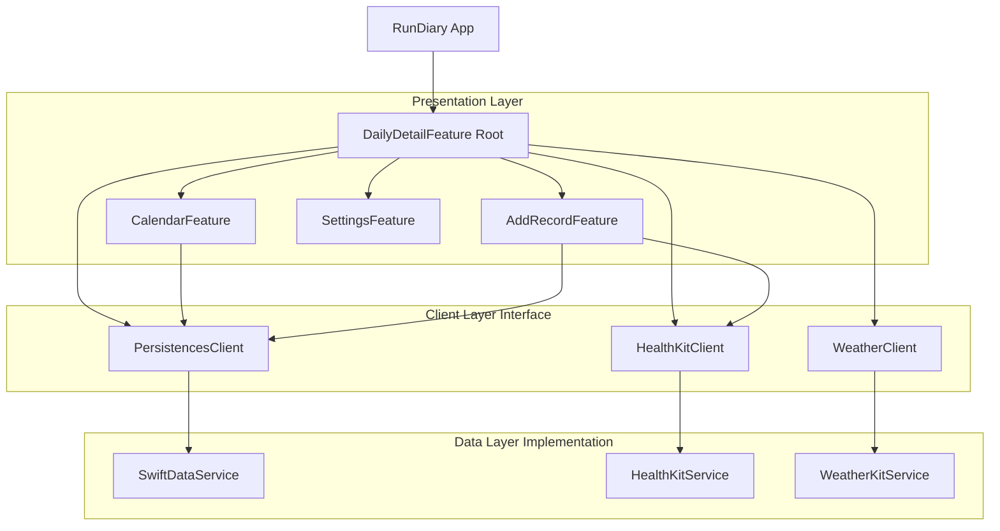

# Architecture

RunDiary는 **The Composable Architecture (TCA)** 를 기반으로 설계되어 단방향 데이터 흐름을 보장하고, 테스트 용이성과 상태 관리의 예측 가능성을 높였습니다.

## 📐 아키텍처 개요

앱은 크게 **Feature(UI & Logic)**, **Client (Interface)**, **Service (Implementation)**, **Model (Domain)** 계층으로 분리되어 있습니다.

## 🧩 모듈 구조

SPM(Swift Package Manager)을 활용하여 기능을 모듈화했습니다.

| 모듈명 | 역할 | 주요 내용 |
|--------|------|----------|
| **RunDiary** | 메인 앱 타겟 | `App.swift`, `DailyDetail`(Root Feature), `Calendar`, `AddRecord`, `Settings` Features |
| **Dependencies** | 모듈 컨테이너 | 기능별 하위 모듈 포함 |
| ↳ **Models** | 도메인 모델 | `Diary`, `Workout`, `Condition` 등 데이터 구조체 |
| ↳ **CommonFoundation** | 공통 유틸리티 | 기본 익스텐션, 유틸리티 함수 |
| ↳ **PersistencesService** | 로컬 저장소 | SwiftData 관련 로직 및 `PersistencesClient` 구현 |
| ↳ **HealthKitService** | 헬스 데이터 | HealthKit 권한 요청 및 `HealthKitClient` 구현 |
| ↳ **WeatherKitService** | 날씨 데이터 | WeatherKit 조회 및 `WeatherClient` 구현 |
| ↳ **DependencyProxy** | 의존성 주입 | TCA `DependencyValues` 확장 및 클라이언트 인터페이스 정의 |

## 🔄 데이터 흐름 (Data Flow)

모든 상태 변경은 **Action**을 통해 시작되며, **Reducer**에서 처리된 후 **State**에 반영됩니다.

1.  **User Action**: 사용자가 "기록 추가" 버튼 클릭
2.  **Reducer**: `DailyDetailFeature`에서 `AddRecordFeature`를 present (State 변경)
3.  **User Input**: 사용자가 기록 입력 후 저장
4.  **Effect**: `AddRecordFeature`에서 `PersistencesClient.updateRecord` 호출 (DB 저장)
5.  **Delegate**: 저장 완료 이벤트를 `DailyDetailFeature`에 전달
6.  **Refresh**: `DailyDetailFeature`가 `fetchWeekRecords` 액션 실행하여 최신 데이터 로드

## 🧪 테스트 전략

TCA의 `TestStore`를 활용하여 비즈니스 로직을 단위 테스트합니다.

-   **State 검증**: 액션 수행 전후의 State 변화를 정밀하게 assertion
-   **Effect 검증**: API 호출 등 Side Effect의 실행 및 결과 값 모의(Mocking) 검증
